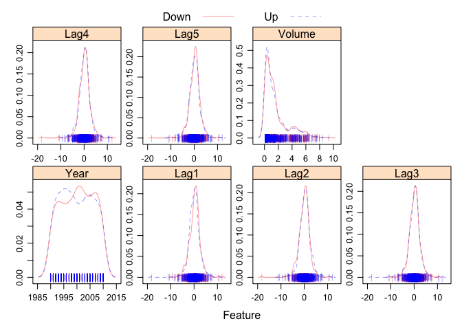
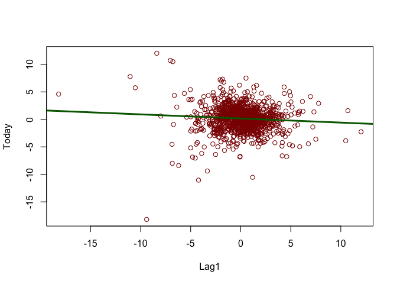
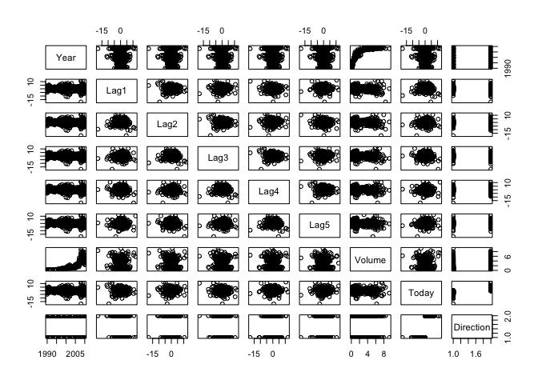
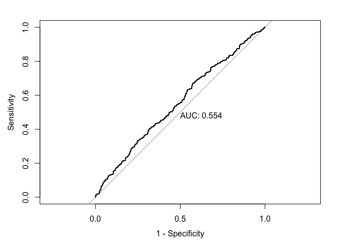
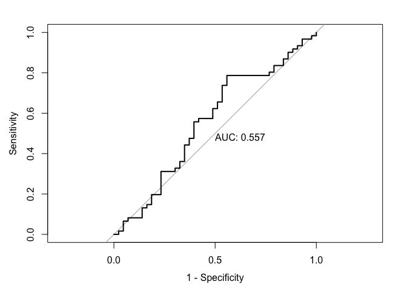
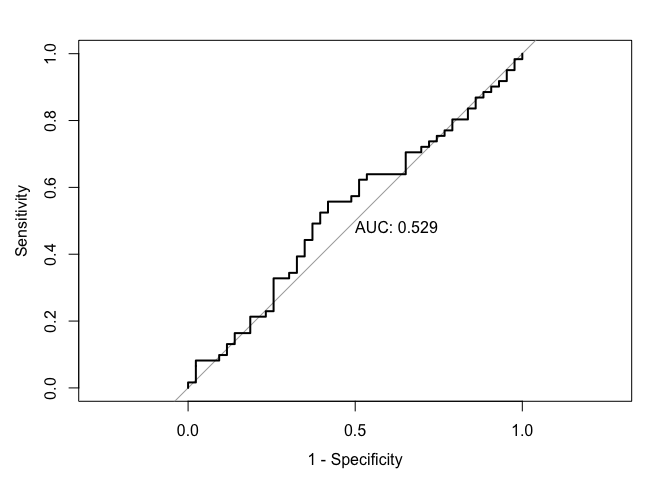
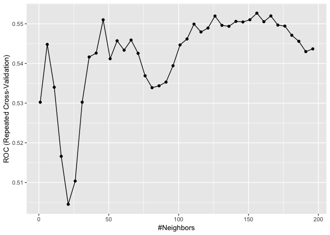
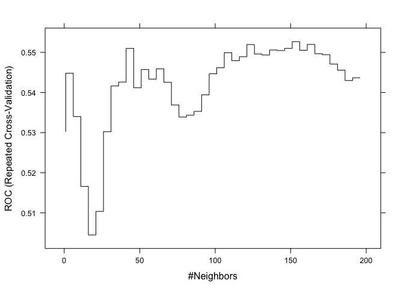
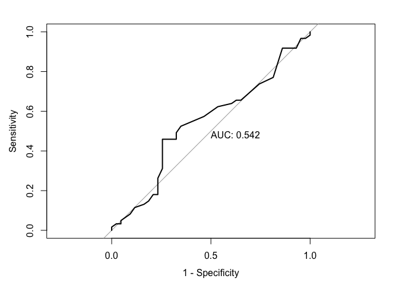

Data Science II Homework 3
================
Charlotte Abrams
4/09/2019

------------------------------------------------------------------------

``` r
library(ISLR)
library(MASS)
library(caret)
```

    ## Loading required package: lattice

    ## Loading required package: ggplot2

``` r
library(class)
library(glmnet)
```

    ## Loading required package: Matrix

    ## Loading required package: foreach

    ## Loaded glmnet 2.0-16

``` r
library(e1071)
library(mlbench)
library(pROC)
```

    ## Type 'citation("pROC")' for a citation.

    ## 
    ## Attaching package: 'pROC'

    ## The following object is masked from 'package:glmnet':
    ## 
    ##     auc

    ## The following objects are masked from 'package:stats':
    ## 
    ##     cov, smooth, var

``` r
library(AppliedPredictiveModeling)
```

### Part (a)

Produce some graphical summaries of the Weekly data.

``` r
data("Weekly")

#Summarize data
summary(Weekly)
```

    ##       Year           Lag1               Lag2               Lag3         
    ##  Min.   :1990   Min.   :-18.1950   Min.   :-18.1950   Min.   :-18.1950  
    ##  1st Qu.:1995   1st Qu.: -1.1540   1st Qu.: -1.1540   1st Qu.: -1.1580  
    ##  Median :2000   Median :  0.2410   Median :  0.2410   Median :  0.2410  
    ##  Mean   :2000   Mean   :  0.1506   Mean   :  0.1511   Mean   :  0.1472  
    ##  3rd Qu.:2005   3rd Qu.:  1.4050   3rd Qu.:  1.4090   3rd Qu.:  1.4090  
    ##  Max.   :2010   Max.   : 12.0260   Max.   : 12.0260   Max.   : 12.0260  
    ##       Lag4               Lag5              Volume       
    ##  Min.   :-18.1950   Min.   :-18.1950   Min.   :0.08747  
    ##  1st Qu.: -1.1580   1st Qu.: -1.1660   1st Qu.:0.33202  
    ##  Median :  0.2380   Median :  0.2340   Median :1.00268  
    ##  Mean   :  0.1458   Mean   :  0.1399   Mean   :1.57462  
    ##  3rd Qu.:  1.4090   3rd Qu.:  1.4050   3rd Qu.:2.05373  
    ##  Max.   : 12.0260   Max.   : 12.0260   Max.   :9.32821  
    ##      Today          Direction 
    ##  Min.   :-18.1950   Down:484  
    ##  1st Qu.: -1.1540   Up  :605  
    ##  Median :  0.2410             
    ##  Mean   :  0.1499             
    ##  3rd Qu.:  1.4050             
    ##  Max.   : 12.0260

``` r
transparentTheme(trans = .4)
featurePlot(x = Weekly[, 1:7],
  y = Weekly$Direction,
  scales = list(x = list(relation = "free"),
    y = list(relation = "free")),
  plot = "density", pch = "|",
  auto.key = list(columns = 2))
```



``` r
#Plot data
plot(Today~Lag1, col = "darkred", data = Weekly)
simplelm = lm(Today~Lag1, data = Weekly)
abline(simplelm, lwd = 3, col = "darkgreen")
```



``` r
pairs(Weekly)  
```



### Part (b)

Use the full data set to perform a logistic regression with Direction as the response and the five Lag variables plus Volume as predictors. Do any of the predictors appear to be statistically significant? If so, which ones?

``` r
glm.fit <- glm(Direction ~ Lag1 + Lag2 + Lag3 + Lag4 + Lag5 + Volume,
               data = Weekly,
               family = binomial)
summary(glm.fit)
```

    ## 
    ## Call:
    ## glm(formula = Direction ~ Lag1 + Lag2 + Lag3 + Lag4 + Lag5 + 
    ##     Volume, family = binomial, data = Weekly)
    ## 
    ## Deviance Residuals: 
    ##     Min       1Q   Median       3Q      Max  
    ## -1.6949  -1.2565   0.9913   1.0849   1.4579  
    ## 
    ## Coefficients:
    ##             Estimate Std. Error z value Pr(>|z|)   
    ## (Intercept)  0.26686    0.08593   3.106   0.0019 **
    ## Lag1        -0.04127    0.02641  -1.563   0.1181   
    ## Lag2         0.05844    0.02686   2.175   0.0296 * 
    ## Lag3        -0.01606    0.02666  -0.602   0.5469   
    ## Lag4        -0.02779    0.02646  -1.050   0.2937   
    ## Lag5        -0.01447    0.02638  -0.549   0.5833   
    ## Volume      -0.02274    0.03690  -0.616   0.5377   
    ## ---
    ## Signif. codes:  0 '***' 0.001 '**' 0.01 '*' 0.05 '.' 0.1 ' ' 1
    ## 
    ## (Dispersion parameter for binomial family taken to be 1)
    ## 
    ##     Null deviance: 1496.2  on 1088  degrees of freedom
    ## Residual deviance: 1486.4  on 1082  degrees of freedom
    ## AIC: 1500.4
    ## 
    ## Number of Fisher Scoring iterations: 4

``` r
contrasts(Weekly$Direction)
```

    ##      Up
    ## Down  0
    ## Up    1

-   As we can see above, Lag2 is the only predictor that appears to be statistically significant (p-value: 0.0296).

### Part (c)

Compute the confusion matrix and overall fraction of correct predictions. Briefly explain what the confusion matrix is telling you.

``` r
test.pred.prob <- predict(glm.fit, 
                         type = "response",
                         newdata = Weekly)
test.pred <- rep("Down", length(test.pred.prob))
test.pred[test.pred.prob > 0.5] <- "Up"

confusionMatrix(data = as.factor(test.pred),
                reference = Weekly$Direction,
                positive = "Down")
```

    ## Confusion Matrix and Statistics
    ## 
    ##           Reference
    ## Prediction Down  Up
    ##       Down   54  48
    ##       Up    430 557
    ##                                          
    ##                Accuracy : 0.5611         
    ##                  95% CI : (0.531, 0.5908)
    ##     No Information Rate : 0.5556         
    ##     P-Value [Acc > NIR] : 0.369          
    ##                                          
    ##                   Kappa : 0.035          
    ##  Mcnemar's Test P-Value : <2e-16         
    ##                                          
    ##             Sensitivity : 0.11157        
    ##             Specificity : 0.92066        
    ##          Pos Pred Value : 0.52941        
    ##          Neg Pred Value : 0.56434        
    ##              Prevalence : 0.44444        
    ##          Detection Rate : 0.04959        
    ##    Detection Prevalence : 0.09366        
    ##       Balanced Accuracy : 0.51612        
    ##                                          
    ##        'Positive' Class : Down           
    ## 

-   From the Confusion Matrix, we can see that we're predicting most of the cases as positives (UP). Becuase of this, we're good at finding the true positives, but also have 430/987 false positives. This also means that we find 430 false positives. Of the true negatives, we're only identifying 54/484 of them correctly, which is not great.

### Part (d)

Plot the ROC curve using the predicted probability from logistic regression and report the AUC.

``` r
roc.glm <- roc(Weekly$Direction, test.pred.prob)
plot(roc.glm, legacy.axes = TRUE, print.auc = TRUE)
```

 - AUC: 0.554

### Part (e)

Now fit the logistic regression model using a training data period from 1990 to 2008, with Lag1 and Lag2 as the predictors. Plot the ROC curve using the held out data (that is, the data from 2009 and 2010) and report the AUC.

``` r
training.data <- Weekly[Weekly$Year < 2009,]
test.data <- Weekly[Weekly$Year > 2008,]

glm.fit2 = glm(Direction~Lag1+Lag2, 
               data = training.data,
               family = binomial)
summary(glm.fit2)
```

    ## 
    ## Call:
    ## glm(formula = Direction ~ Lag1 + Lag2, family = binomial, data = training.data)
    ## 
    ## Deviance Residuals: 
    ##     Min       1Q   Median       3Q      Max  
    ## -1.6149  -1.2565   0.9989   1.0875   1.5330  
    ## 
    ## Coefficients:
    ##             Estimate Std. Error z value Pr(>|z|)   
    ## (Intercept)  0.21109    0.06456   3.269  0.00108 **
    ## Lag1        -0.05421    0.02886  -1.878  0.06034 . 
    ## Lag2         0.05384    0.02905   1.854  0.06379 . 
    ## ---
    ## Signif. codes:  0 '***' 0.001 '**' 0.01 '*' 0.05 '.' 0.1 ' ' 1
    ## 
    ## (Dispersion parameter for binomial family taken to be 1)
    ## 
    ##     Null deviance: 1354.7  on 984  degrees of freedom
    ## Residual deviance: 1347.0  on 982  degrees of freedom
    ## AIC: 1353
    ## 
    ## Number of Fisher Scoring iterations: 4

``` r
test.pred.prob2 <- predict(glm.fit2,
                           newdata = test.data,
                           type = "response")

roc.glm2 <- roc(test.data$Direction, 
                test.pred.prob2)
plot(roc.glm2, legacy.axes = TRUE, print.auc = TRUE)
```

 - AUC: 0.556

### Part (f)

Repeat (e) using LDA and QDA.

``` r
#LDA
lda.fit <- lda(Direction~Lag1 + Lag2,
               data = training.data)
summary(lda.fit)
```

    ##         Length Class  Mode     
    ## prior   2      -none- numeric  
    ## counts  2      -none- numeric  
    ## means   4      -none- numeric  
    ## scaling 2      -none- numeric  
    ## lev     2      -none- character
    ## svd     1      -none- numeric  
    ## N       1      -none- numeric  
    ## call    3      -none- call     
    ## terms   3      terms  call     
    ## xlevels 0      -none- list

``` r
lda.pred.prob <- predict(lda.fit,
                           newdata = test.data)

head(lda.pred.prob$posterior)
```

    ##          Down        Up
    ## 986 0.5602039 0.4397961
    ## 987 0.3079163 0.6920837
    ## 988 0.4458032 0.5541968
    ## 989 0.4785107 0.5214893
    ## 990 0.4657943 0.5342057
    ## 991 0.5262907 0.4737093

``` r
roc.lda <- roc(test.data$Direction, 
                lda.pred.prob$posterior[,2])
plot(roc.lda, legacy.axes = TRUE, print.auc = TRUE)
```



``` r
#QDA
qda.fit <- qda(Direction~Lag1 + Lag2, 
               data = training.data)
summary(qda.fit)
```

    ##         Length Class  Mode     
    ## prior   2      -none- numeric  
    ## counts  2      -none- numeric  
    ## means   4      -none- numeric  
    ## scaling 8      -none- numeric  
    ## ldet    2      -none- numeric  
    ## lev     2      -none- character
    ## N       1      -none- numeric  
    ## call    3      -none- call     
    ## terms   3      terms  call     
    ## xlevels 0      -none- list

``` r
qda.pred.prob <- predict(qda.fit,
                           newdata = test.data)

head(qda.pred.prob$posterior)
```

    ##          Down        Up
    ## 986 0.5436205 0.4563795
    ## 987 0.3528814 0.6471186
    ## 988 0.2227273 0.7772727
    ## 989 0.3483016 0.6516984
    ## 990 0.4598550 0.5401450
    ## 991 0.5119613 0.4880387

``` r
roc.qda <- roc(test.data$Direction, 
                qda.pred.prob$posterior[,2])
plot(roc.qda, legacy.axes = TRUE, print.auc = TRUE)
```

 - LDA AUC: 0.557 - QDA AUC: 0.529

### Part (g)

Repeat (e) using KNN. Briefly discuss your results.

``` r
set.seed(123)
train.X <- training.data[, 2:3]
test.X <- test.data[, 2:3]
train.Y <- training.data$Direction

set.seed(123)

knn.pred <- knn(train.X, test.X, train.Y, k = 1)
table(knn.pred, test.data$Direction)
```

    ##         
    ## knn.pred Down Up
    ##     Down   18 29
    ##     Up     25 32

``` r
knn5.pred = knn(train.X, test.X, train.Y, k = 5)
table(knn5.pred, test.data$Direction)
```

    ##          
    ## knn5.pred Down Up
    ##      Down   22 32
    ##      Up     21 29

``` r
ctrl <- trainControl(method = "repeatedcv",
                     repeats = 5,
                     summaryFunction = twoClassSummary,
                     classProbs = TRUE)

knn.fit <- train(Direction ~ Lag1 + Lag2,
                   data = training.data,
                   method = "knn",
                   preProcess = c("center","scale"),
                   tuneGrid = data.frame(k = seq(1,200,by = 5)),
                   trControl = ctrl,
                   metric = "ROC")

ggplot(knn.fit)
```



``` r
knn.fit$finalModel
```

    ## 156-nearest neighbor model
    ## Training set outcome distribution:
    ## 
    ## Down   Up 
    ##  441  544

``` r
knn.fit$bestTune
```

    ##      k
    ## 32 156

``` r
knn.pred.prob <- predict(knn.fit, 
                       newdata = test.data,
                       type = "prob")[,2]

plot(knn.fit, print.thres = 0.5, type = "S")
```



``` r
roc.knn <- roc(test.data$Direction, 
                knn.pred.prob)

plot(roc.knn, legacy.axes = TRUE, print.auc = TRUE)
```



-   From our KNN model, we can see that as K gets larger, the amount of true findings increases. Our model, however, seems to be better at finding true positives and worse at finding true negatives (AUC: 0.542).
