Data Science II Homework 4
================
Charlotte Abrams
4/21/2019

------------------------------------------------------------------------

``` r
library(lasso2)
```

    ## R Package to solve regression problems while imposing
    ##   an L1 constraint on the parameters. Based on S-plus Release 2.1
    ## Copyright (C) 1998, 1999
    ## Justin Lokhorst   <jlokhors@stats.adelaide.edu.au>
    ## Berwin A. Turlach <bturlach@stats.adelaide.edu.au>
    ## Bill Venables     <wvenable@stats.adelaide.edu.au>
    ## 
    ## Copyright (C) 2002
    ## Martin Maechler <maechler@stat.math.ethz.ch>

``` r
library(ISLR)
library(caret)
```

    ## Loading required package: lattice

    ## Loading required package: ggplot2

``` r
library(rpart)
library(rpart.plot)
library(tree)
library(gbm)
```

    ## Loaded gbm 2.1.5

``` r
library(party)
```

    ## Loading required package: grid

    ## Loading required package: mvtnorm

    ## Loading required package: modeltools

    ## Loading required package: stats4

    ## Loading required package: strucchange

    ## Loading required package: zoo

    ## 
    ## Attaching package: 'zoo'

    ## The following objects are masked from 'package:base':
    ## 
    ##     as.Date, as.Date.numeric

    ## Loading required package: sandwich

``` r
library(partykit)
```

    ## Loading required package: libcoin

    ## 
    ## Attaching package: 'partykit'

    ## The following objects are masked from 'package:party':
    ## 
    ##     cforest, ctree, ctree_control, edge_simple, mob, mob_control,
    ##     node_barplot, node_bivplot, node_boxplot, node_inner,
    ##     node_surv, node_terminal, varimp

``` r
library(randomForest)
```

    ## randomForest 4.6-14

    ## Type rfNews() to see new features/changes/bug fixes.

    ## 
    ## Attaching package: 'randomForest'

    ## The following object is masked from 'package:ggplot2':
    ## 
    ##     margin

``` r
library(ranger)
```

    ## 
    ## Attaching package: 'ranger'

    ## The following object is masked from 'package:randomForest':
    ## 
    ##     importance

``` r
library(plotmo)
```

    ## Loading required package: Formula

    ## Loading required package: plotrix

    ## Loading required package: TeachingDemos

``` r
library(pdp)
library(lime)
```

Question 1
----------

### Part 1(a)

Fit a regression tree with lpsa as the response and the other variables as predictors. Use cross-validation to determine the optimal tree size. Which tree size corresponds to the lowest cross-validation error? Is this the same as the tree size obtained using the 1 SE rule?

``` r
data("Prostate")

#Summarize data
summary(Prostate)
```

    ##      lcavol           lweight           age             lbph        
    ##  Min.   :-1.3471   Min.   :2.375   Min.   :41.00   Min.   :-1.3863  
    ##  1st Qu.: 0.5128   1st Qu.:3.376   1st Qu.:60.00   1st Qu.:-1.3863  
    ##  Median : 1.4469   Median :3.623   Median :65.00   Median : 0.3001  
    ##  Mean   : 1.3500   Mean   :3.653   Mean   :63.87   Mean   : 0.1004  
    ##  3rd Qu.: 2.1270   3rd Qu.:3.878   3rd Qu.:68.00   3rd Qu.: 1.5581  
    ##  Max.   : 3.8210   Max.   :6.108   Max.   :79.00   Max.   : 2.3263  
    ##       svi              lcp             gleason          pgg45       
    ##  Min.   :0.0000   Min.   :-1.3863   Min.   :6.000   Min.   :  0.00  
    ##  1st Qu.:0.0000   1st Qu.:-1.3863   1st Qu.:6.000   1st Qu.:  0.00  
    ##  Median :0.0000   Median :-0.7985   Median :7.000   Median : 15.00  
    ##  Mean   :0.2165   Mean   :-0.1794   Mean   :6.753   Mean   : 24.38  
    ##  3rd Qu.:0.0000   3rd Qu.: 1.1787   3rd Qu.:7.000   3rd Qu.: 40.00  
    ##  Max.   :1.0000   Max.   : 2.9042   Max.   :9.000   Max.   :100.00  
    ##       lpsa        
    ##  Min.   :-0.4308  
    ##  1st Qu.: 1.7317  
    ##  Median : 2.5915  
    ##  Mean   : 2.4784  
    ##  3rd Qu.: 3.0564  
    ##  Max.   : 5.5829

``` r
set.seed(1)
ctrl <- trainControl(method = "cv")
tree.prostate <- rpart(formula = lpsa~., 
                       data = Prostate,
                       control = rpart.control(cp = 0.001))

rpart.plot(tree.prostate)
```

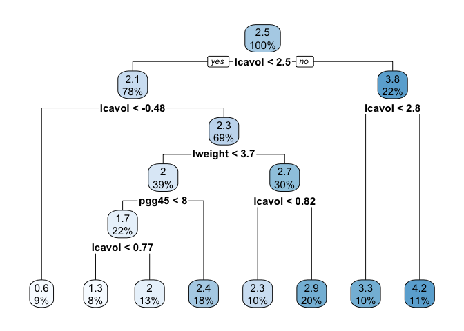

``` r
cpTable <- printcp(tree.prostate)
```

    ## 
    ## Regression tree:
    ## rpart(formula = lpsa ~ ., data = Prostate, control = rpart.control(cp = 0.001))
    ## 
    ## Variables actually used in tree construction:
    ## [1] lcavol  lweight pgg45  
    ## 
    ## Root node error: 127.92/97 = 1.3187
    ## 
    ## n= 97 
    ## 
    ##         CP nsplit rel error  xerror     xstd
    ## 1 0.347108      0   1.00000 1.01687 0.163742
    ## 2 0.184647      1   0.65289 0.89137 0.112926
    ## 3 0.059316      2   0.46824 0.81363 0.111838
    ## 4 0.034756      3   0.40893 0.70667 0.092263
    ## 5 0.034609      4   0.37417 0.70171 0.090879
    ## 6 0.021564      5   0.33956 0.69128 0.090257
    ## 7 0.021470      6   0.31800 0.67139 0.080849
    ## 8 0.001000      7   0.29653 0.64305 0.081145

``` r
plotcp(tree.prostate)
```

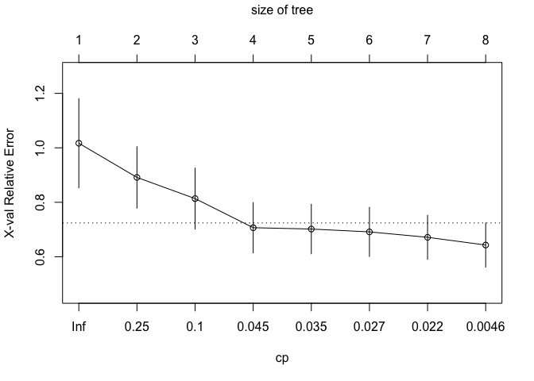

``` r
#Prune the tree based on the cp table
minErr <- which.min(cpTable[,4])

#minimum cross-validation error
tree.prostate.prune <- prune(tree.prostate, cp = cpTable[minErr,1])

#1SE rule
tree.prostate.SE <- prune(tree.prostate, cp = cpTable[cpTable[,4] < cpTable[minErr,4] + cpTable[minErr,5],1][1])
```

-   Cross-validation determined that 8 was the optimal tree size (this tree size corresponded to the lowest cross-validation error). This is different, however, than the tree size obtained using the 1SE rule, which chose 4 s the optimal tree size.

### Part 1(b)

Create a plot of the final tree you choose. Pick one of the terminal nodes, and interpret the information displayed.

``` r
rpart.plot(tree.prostate.SE)
```

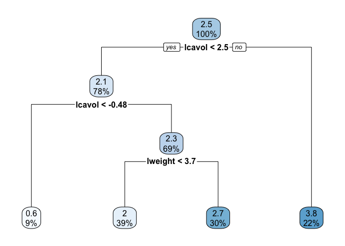

``` r
tree.prostate.SE
```

    ## n= 97 
    ## 
    ## node), split, n, deviance, yval
    ##       * denotes terminal node
    ## 
    ##  1) root 97 127.917700 2.4783870  
    ##    2) lcavol< 2.46165 76  67.267100 2.1227440  
    ##      4) lcavol< -0.4785564 9   5.597501 0.6016839 *
    ##      5) lcavol>=-0.4785564 67  38.049940 2.3270650  
    ##       10) lweight< 3.68886 38  21.507510 2.0330830 *
    ##       11) lweight>=3.68886 29   8.954878 2.7122820 *
    ##    3) lcavol>=2.46165 21  16.249280 3.7654770 *

-   I decided to look at the terminal node labelled 10. We know this is a terminal node because of the \*. The split criterion is lweight &lt; 3.68886. We know there are 38 observations in this branch with a deviance of 21.507510. The mean lpsa for observations with lweight&lt;3.68886 is 2.0330830.

### Part 1(c)

Perform bagging and report the variable importance.

``` r
bagging.grid <- expand.grid(mtry = 8, 
                       splitrule = "variance",
                       min.node.size = 1:20) 

set.seed(1)

bagging <- train(lpsa~., Prostate, 
                method = "ranger",
                tuneGrid = bagging.grid,
                trControl = ctrl,
                importance = 'permutation')

ggplot(bagging, highlight = TRUE)
```

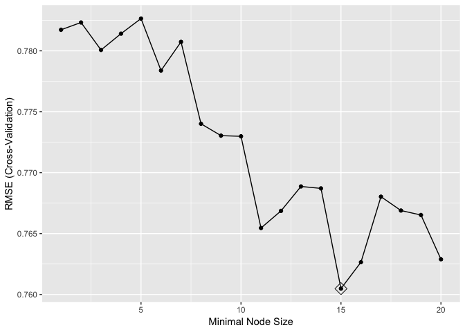

``` r
barplot(sort(ranger::importance(bagging$finalModel),
             decreasing = FALSE), 
        las = 2, horiz = TRUE, cex.names = 0.7,
        col = colorRampPalette(colors = c("darkred","white","darkblue"))(19))
```

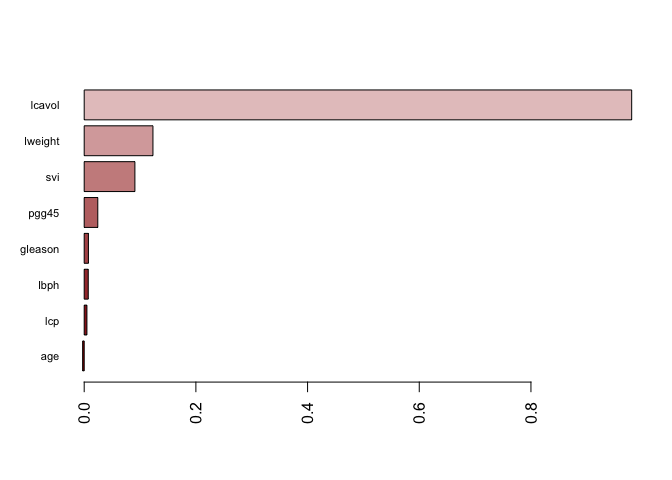

``` r
bagging$results[which.min(bagging$results[,5]),]
```

    ##   mtry splitrule min.node.size      RMSE  Rsquared       MAE    RMSESD
    ## 6    8  variance             6 0.7783825 0.5876399 0.6406368 0.1444136
    ##   RsquaredSD     MAESD
    ## 6   0.149867 0.1342854

-   From the barplot, we can see that lcavol has the highest importance, followd by lweight, svi, pgg45, lbph, lcp, gleason, and finally age with the lowest.

### Part 1(d)

Perform random forests and report the variable importance.

``` r
rf.grid <- expand.grid(mtry = 1:7, 
                       splitrule = "variance",
                       min.node.size = 1:20) 

set.seed(1)

rf.fit <- train(lpsa~., Prostate,
                method = "ranger",
                tuneGrid = rf.grid,
                trControl = ctrl,
                importance = 'permutation')

ggplot(rf.fit, highlight = TRUE)
```

    ## Warning: The shape palette can deal with a maximum of 6 discrete values
    ## because more than 6 becomes difficult to discriminate; you have 7.
    ## Consider specifying shapes manually if you must have them.

    ## Warning: Removed 20 rows containing missing values (geom_point).

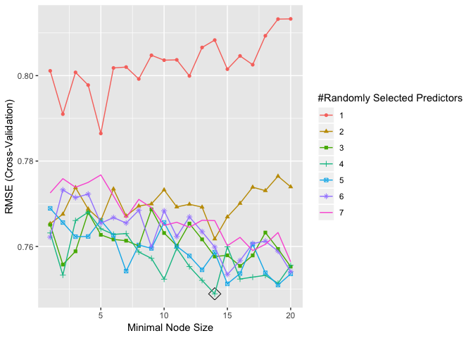

``` r
barplot(sort(ranger::importance(rf.fit$finalModel), 
             decreasing = FALSE), 
        las = 2, horiz = TRUE, cex.names = 0.7,
        col = colorRampPalette(colors = c("darkred","white","darkblue"))(19))
```

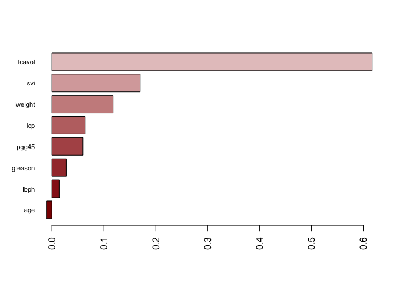

``` r
rf.fit$results[which.min(rf.fit$results[,5]),]
```

    ##     mtry splitrule min.node.size      RMSE  Rsquared       MAE    RMSESD
    ## 125    7  variance             5 0.7767589 0.5952353 0.6345633 0.1443511
    ##     RsquaredSD     MAESD
    ## 125  0.1483151 0.1362274

-   From the barplot, we can see that lcavol has the highest importance, followd by svi, lweight, lcp, pgg45, gleason, lbph, and finally age with the lowest.

### Part 1(e)

Perform boosting and report the variable importance.

``` r
gbm.grid <- expand.grid(n.trees = c(2000,3000,5000),
                        interaction.depth = 2:10, 
                        shrinkage = c(0.01,0.001,0.003,0.005),
                        n.minobsinnode = 1)

gbm.grid <- expand.grid(n.trees = c(2000,3000),
                        interaction.depth = 2:10, 
                        shrinkage = c(0.001,0.003,0.005),
                        n.minobsinnode = 1)

set.seed(1)

gbm.fit <- train(lpsa ~., Prostate, 
                 method = "gbm",
                 tuneGrid = gbm.grid,
                 verbose = FALSE,
                 trControl = ctrl)

ggplot(gbm.fit, highlight = TRUE)
```

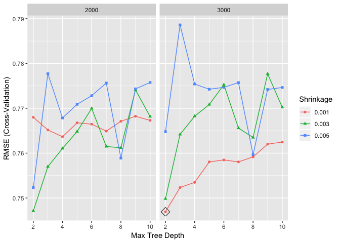

``` r
summary(gbm.fit$finalModel, 
        las = 2, 
        cBars = 19, 
        cex.names = 0.6)
```

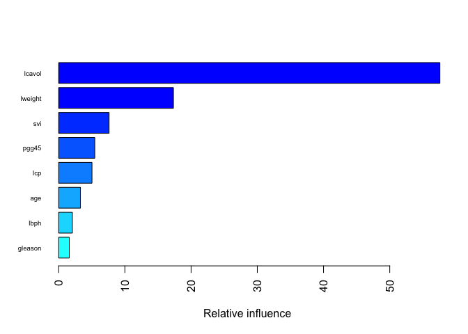

    ##             var   rel.inf
    ## lcavol   lcavol 57.574689
    ## lweight lweight 17.335025
    ## svi         svi  7.619823
    ## pgg45     pgg45  5.457903
    ## lcp         lcp  5.036310
    ## age         age  3.289945
    ## lbph       lbph  2.075507
    ## gleason gleason  1.610798

-   From the barplot, we can see that lcavol has the highest importance, followd by lweight, svi, pgg45, lcp, age, lbph, and finally gleason with the lowest.

### Part 1(f)

Which of the above models will you select to predict PSA level? Explain.

``` r
overall = resamples(list(rf = rf.fit, gbm = gbm.fit, bagging = bagging))
summary(overall)
```

    ## 
    ## Call:
    ## summary.resamples(object = overall)
    ## 
    ## Models: rf, gbm, bagging 
    ## Number of resamples: 10 
    ## 
    ## MAE 
    ##              Min.   1st Qu.    Median      Mean   3rd Qu.      Max. NA's
    ## rf      0.4388518 0.5752939 0.5988010 0.6240935 0.6357321 0.9806087    0
    ## gbm     0.4244881 0.5524132 0.5923318 0.6186929 0.6578665 0.9043156    0
    ## bagging 0.4744007 0.5785223 0.5947370 0.6325892 0.6277988 0.9632561    0
    ## 
    ## RMSE 
    ##              Min.   1st Qu.    Median      Mean   3rd Qu.      Max. NA's
    ## rf      0.4936100 0.6643460 0.7544224 0.7489068 0.8336855 1.0827494    0
    ## gbm     0.5176413 0.6741674 0.7492042 0.7469127 0.8155392 0.9940913    0
    ## bagging 0.5560895 0.6843114 0.7420510 0.7604800 0.8229470 1.0751279    0
    ## 
    ## Rsquared 
    ##              Min.   1st Qu.    Median      Mean   3rd Qu.      Max. NA's
    ## rf      0.2612565 0.6004245 0.6769932 0.6350320 0.7105999 0.7609664    0
    ## gbm     0.3403789 0.5932232 0.6810507 0.6395704 0.7170313 0.7862778    0
    ## bagging 0.2115985 0.5719590 0.6745214 0.6139633 0.7080146 0.7496108    0

-   From the summary, we can see that the bagging model has the lowest mean RMSE, therefore, I would select that model to predict PSA level.

Question 2
----------

``` r
oj = OJ

set.seed(1)
rowTrain <- sample(1:nrow(oj), 800)
train <- oj[rowTrain,]
test <- oj[-rowTrain,]

ctrl <- trainControl(method = "repeatedcv")
```

### Part 2(a)

Fit a classification tree to the training set, with Purchase as the response and the other variables as predictors. Use cross-validation to determine the tree size and create a plot of the final tree. Predict the response on the test data. What is the test classification error rate?

``` r
set.seed(1)
rpart.class <- train(Purchase ~., OJ, 
                   subset = rowTrain,
                   method = "rpart",
                   tuneGrid = data.frame(cp = exp(seq(-7,-2, len = 50))),
                   trControl = ctrl,
                   metric = "Accuracy")
ggplot(rpart.class, highlight = T)
```

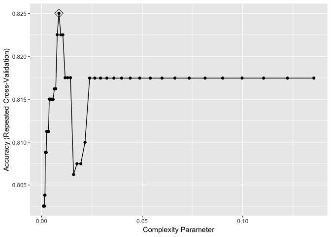

``` r
rpart.plot(rpart.class$finalModel)
```

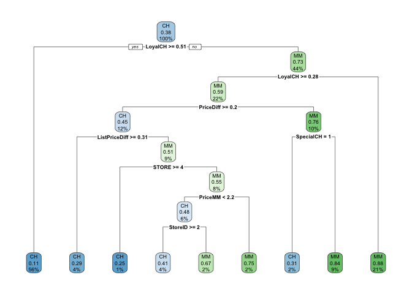

### Part 2(b)

Perform random forests on the training set and report variable importance. What is the test error rate?

``` r
rf.grid <- expand.grid(mtry = 1:10,
                       splitrule = "gini",
                       min.node.size = 1:6)
set.seed(1)

rf.class <- train(Purchase ~., OJ, 
                subset = rowTrain,
                method = "ranger",
                tuneGrid = rf.grid,
                metric = "Accuracy",
                trControl = ctrl,
                importance = 'permutation')
ggplot(rf.class, highlight = TRUE)
```

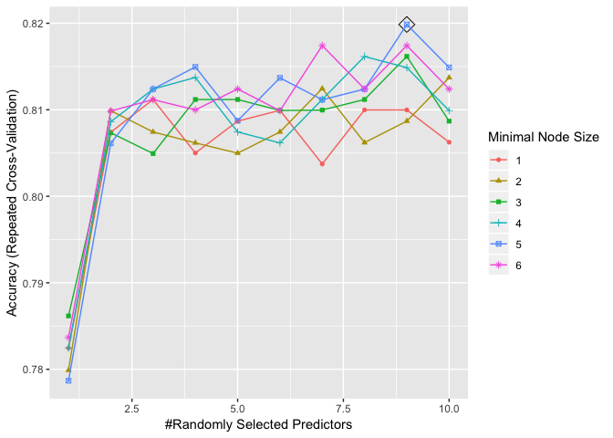

``` r
rf.pred = predict(rf.class, newdata = OJ[-rowTrain,])

error_rate_rf <- mean(rf.pred != OJ$Purchase[-rowTrain])
```

-   The test error rate is 0.2

### Part 2(c)

Perform boosting on the training set and report variable importance. What is the test error rate?

``` r
boosting.grid <- expand.grid(n.trees = c(2000,3000,4000),
                        interaction.depth = 1:6,
                        shrinkage = c(0.001,0.003,0.005),
                        n.minobsinnode = 1)

set.seed(1)

boosting.fit <- train(Purchase ~., oj, 
                 subset = rowTrain, 
                 tuneGrid = boosting.grid,
                 trControl = ctrl,
                 method = "gbm",
                 distribution = "adaboost",
                 metric = "Accuracy",
                 verbose = FALSE)

ggplot(boosting.fit, highlight = TRUE)
```

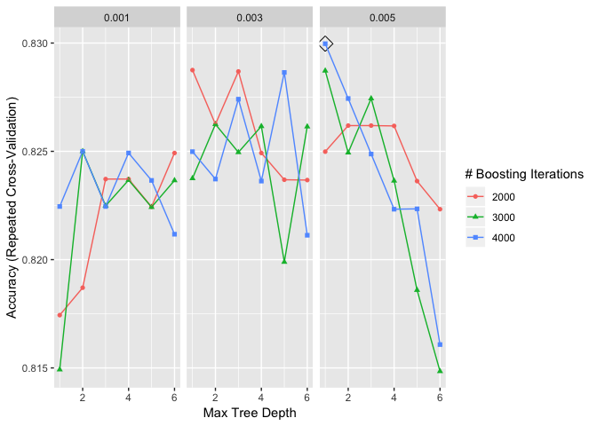

``` r
gbm.pred = predict(boosting.fit, newdata = OJ[-rowTrain,])

error_rate_boost <- mean(gbm.pred != OJ$Purchase[-rowTrain])
```

-   The test error rate is 0.1962
