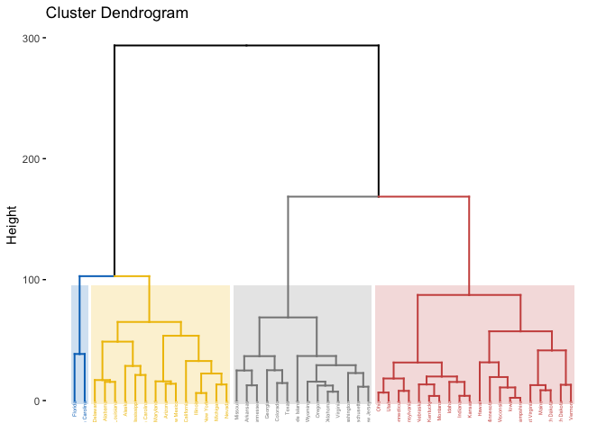
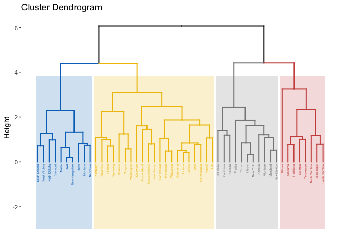

Data Science II Homework 6
================
Charlotte Abrams
5/07/2019

------------------------------------------------------------------------

``` r
library(ISLR)
library(factoextra)
```

    ## Loading required package: ggplot2

    ## Welcome! Related Books: `Practical Guide To Cluster Analysis in R` at https://goo.gl/13EFCZ

``` r
library(gridExtra)
library(corrplot)
```

    ## corrplot 0.84 loaded

``` r
library(RColorBrewer)
library(gplots)
```

    ## 
    ## Attaching package: 'gplots'

    ## The following object is masked from 'package:stats':
    ## 
    ##     lowess

``` r
library(ape)
library(RColorBrewer)
library(dplyr)
```

    ## 
    ## Attaching package: 'dplyr'

    ## The following object is masked from 'package:gridExtra':
    ## 
    ##     combine

    ## The following objects are masked from 'package:stats':
    ## 
    ##     filter, lag

    ## The following objects are masked from 'package:base':
    ## 
    ##     intersect, setdiff, setequal, union

``` r
library(purrr)
```

Cluster Analysis
----------------

We perform hierarchical clustering on the states using the USArrests data in the ISLR package. For each of the 50 states in the United States, the data set contains the number of arrests per 100,000 residents for each of three crimes: Assault, Murder, and Rape. The data set also contains the percent of the population in each state living in urban areas, UrbanPop. The four variables will be used as features for clustering.

``` r
arrests = USArrests
```

### Question 1 (a)

Using hierarchical clustering with complete linkage and Euclidean distance, cluster the states.

``` r
#Summarize data
summary(arrests)
```

    ##      Murder          Assault         UrbanPop          Rape      
    ##  Min.   : 0.800   Min.   : 45.0   Min.   :32.00   Min.   : 7.30  
    ##  1st Qu.: 4.075   1st Qu.:109.0   1st Qu.:54.50   1st Qu.:15.07  
    ##  Median : 7.250   Median :159.0   Median :66.00   Median :20.10  
    ##  Mean   : 7.788   Mean   :170.8   Mean   :65.54   Mean   :21.23  
    ##  3rd Qu.:11.250   3rd Qu.:249.0   3rd Qu.:77.75   3rd Qu.:26.18  
    ##  Max.   :17.400   Max.   :337.0   Max.   :91.00   Max.   :46.00

``` r
set.seed(1)

hc.complete <- hclust(dist(arrests), method = "complete")

fviz_dend(hc.complete, k = 4,
          cex = 0.3,
          palette = "jco",
          color_labels_by_k = TRUE,
          rect = TRUE, rect_fill = TRUE, rect_border = "jco",
          labels_track_height = 2.5)
```



### Question 1(b)

Cut the dendrogram at a height that results in three distinct clusters. Which states belong to which clusters?

``` r
set.seed(1)
hc.complete.cut <- cutree(hc.complete, 3)
#cluster 1
arrests[hc.complete.cut == 1,]
```

    ##                Murder Assault UrbanPop Rape
    ## Alabama          13.2     236       58 21.2
    ## Alaska           10.0     263       48 44.5
    ## Arizona           8.1     294       80 31.0
    ## California        9.0     276       91 40.6
    ## Delaware          5.9     238       72 15.8
    ## Florida          15.4     335       80 31.9
    ## Illinois         10.4     249       83 24.0
    ## Louisiana        15.4     249       66 22.2
    ## Maryland         11.3     300       67 27.8
    ## Michigan         12.1     255       74 35.1
    ## Mississippi      16.1     259       44 17.1
    ## Nevada           12.2     252       81 46.0
    ## New Mexico       11.4     285       70 32.1
    ## New York         11.1     254       86 26.1
    ## North Carolina   13.0     337       45 16.1
    ## South Carolina   14.4     279       48 22.5

``` r
#cluster 2
arrests[hc.complete.cut == 2,]
```

    ##               Murder Assault UrbanPop Rape
    ## Arkansas         8.8     190       50 19.5
    ## Colorado         7.9     204       78 38.7
    ## Georgia         17.4     211       60 25.8
    ## Massachusetts    4.4     149       85 16.3
    ## Missouri         9.0     178       70 28.2
    ## New Jersey       7.4     159       89 18.8
    ## Oklahoma         6.6     151       68 20.0
    ## Oregon           4.9     159       67 29.3
    ## Rhode Island     3.4     174       87  8.3
    ## Tennessee       13.2     188       59 26.9
    ## Texas           12.7     201       80 25.5
    ## Virginia         8.5     156       63 20.7
    ## Washington       4.0     145       73 26.2
    ## Wyoming          6.8     161       60 15.6

``` r
#cluster 3
arrests[hc.complete.cut == 3,]
```

    ##               Murder Assault UrbanPop Rape
    ## Connecticut      3.3     110       77 11.1
    ## Hawaii           5.3      46       83 20.2
    ## Idaho            2.6     120       54 14.2
    ## Indiana          7.2     113       65 21.0
    ## Iowa             2.2      56       57 11.3
    ## Kansas           6.0     115       66 18.0
    ## Kentucky         9.7     109       52 16.3
    ## Maine            2.1      83       51  7.8
    ## Minnesota        2.7      72       66 14.9
    ## Montana          6.0     109       53 16.4
    ## Nebraska         4.3     102       62 16.5
    ## New Hampshire    2.1      57       56  9.5
    ## North Dakota     0.8      45       44  7.3
    ## Ohio             7.3     120       75 21.4
    ## Pennsylvania     6.3     106       72 14.9
    ## South Dakota     3.8      86       45 12.8
    ## Utah             3.2     120       80 22.9
    ## Vermont          2.2      48       32 11.2
    ## West Virginia    5.7      81       39  9.3
    ## Wisconsin        2.6      53       66 10.8

### Question 1(c)

Hierarchically cluster the states using complete linkage and Euclidean distance, after scaling the variables to have standard deviation one.

``` r
set.seed(1)
sd.data <- scale(arrests)

hc.complete.sd <- hclust(dist(sd.data), method = "complete")

fviz_dend(hc.complete.sd, k = 4,
          cex = 0.3,
          palette = "jco",
          color_labels_by_k = TRUE,
          rect = TRUE, rect_fill = TRUE, rect_border = "jco",
          labels_track_height = 2.5)
```



### Question 1(d)

What effect does scaling the variables have on the hierarchical clustering obtained? In your opinion, should the variables be scaled before the inter-observation dissimilarities are computed?

-   Scaling the variables affects the clusters created. We can see that the clusters in Part (a) and Part (c) are different due to scaling the variable. I think it would be better to scale the variables before the inter-observation dissimilarities are computed. This is because different variables have different units, so it's best to standardize everything earlier so we can compare them on equal grounds.

PCA
---

PCA can be used for image compression. In this question, we use the jpeg package to read and write the .jpeg files. We use a image of cat for illustration, and the sample codes are given in "image.R". Read the image using img &lt;- readJPEG(\`example.jpg'). The image will be represented as three matrices as an array with each matrix corresponding to the RGB color value scheme and each element in a matrix corresponding to one pixel. Extract the individual color value matrices to perform PCA on each of them. Reconstruct the original image using the projections of the data with the first 20 PCs. Now use your own .jpg image to perform image compression via PCA with different numbers of PCs (e.g., 50, 100, 200, ...).

``` r
library(jpeg)

img <- readJPEG('corgi.jpg')

dim(img)
```

    ## [1] 400 600   3

``` r
r <- img[,,1]
g <- img[,,2]
b <- img[,,3]

img.r.pca <- prcomp(r, center = FALSE)
img.g.pca <- prcomp(g, center = FALSE)
img.b.pca <- prcomp(b, center = FALSE)

rgb.pca <- list(img.r.pca, img.g.pca, img.b.pca)

# Approximate X with XV_kV_k^T
compress <- function(pr, k)
{
  compressed.img <- pr$x[,1:k] %*% t(pr$rotation[,1:k])
  compressed.img
}

# Using first 20 PCs
pca20 <- sapply(rgb.pca, compress, k = 20, simplify = "array")

writeJPEG(pca20, "pca20.jpeg")

# Using first 10 PCs
pca10 <- sapply(rgb.pca, compress, k = 10, simplify = "array")

writeJPEG(pca10, "pca10.jpeg")

# Using first 300 PCs
pca300 <- sapply(rgb.pca, compress, k = 300, simplify = "array")

writeJPEG(pca300, "pca300.jpeg")
```
